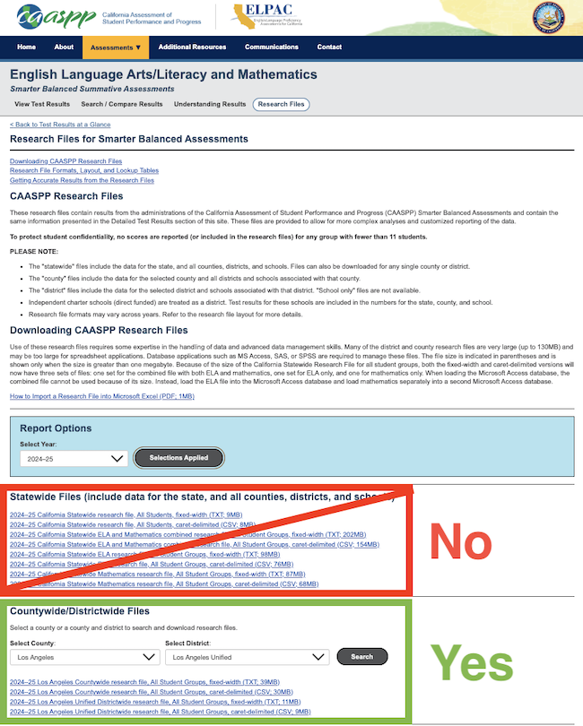

# CAASPP SBS Table Maker

This tool helps California parent/community groups turn public CAASPP files into Google-Sheets-ready CSV and Excel tables for a school district.

You do **not** need to install Python. The easiest way is to open the notebook in Google Colab, upload the CAASPP ZIP files you downloaded, and download the finished CSV or Excel file.

## What this makes

The notebook creates two versions of the same table:

```text
YOUR_PREFIX_caaspp_sed_nsed_met_above.csv
YOUR_PREFIX_caaspp_sed_nsed_met_above.xlsx
```

For example:

```text
lausd_caaspp_sed_nsed_met_above.csv
lausd_caaspp_sed_nsed_met_above.xlsx
```

Both files have the same table:

- rows = academic years
- columns = grade, SED/NSED group, and subject
- values = percent met or exceeded standard

Chapters can upload either file to Google Sheets and make whatever charts or analysis they want. The CSV is usually best for Google Sheets; the Excel file is included because it may feel more familiar to some users.

## Where do I get the CAASPP files?

Download the files from the [CAASPP Smarter Balanced Research Files page](https://caaspp-elpac.ets.org/caaspp/ResearchFileListSB).

On that page, use the **Countywide/Districtwide Files** section. Select your county and district, then download the **Districtwide research file, All Student Groups** file.

Do **not** use the statewide files at the top unless you know you need the entire statewide dataset.

<p align="center">
  
</p>

## What you need before you start

1. Your district's county code and district code.
   - Example: San Marcos Unified = county `37`, district `73791`, file prefix `smusd`
   - Example: Las Virgenes Unified = county `19`, district `64683`, file prefix `lvusd`
2. CAASPP Smarter Balanced districtwide files from the CAASPP website.
   - Choose **All Student Groups**.
   - ZIP files are okay. Do not unzip them unless you want to.
   - Caret-delimited, comma-delimited, and fixed-width text files are supported.

## Run online in Google Colab

After you upload this repo to GitHub, update this link with your GitHub username and repo name:

```text
https://colab.research.google.com/github/isabe11a/caaspp-sbs-chart-tool/blob/main/notebooks/caaspp_sbs_table_maker.ipynb
```

Then share that Colab link with other chapters.

In Colab, users will:

1. Open the notebook.
2. Run each step from top to bottom.
3. Upload their CAASPP ZIP files when prompted.
4. Type in their district name, county code, district code, and short output prefix.
5. Download the finished CSV or Excel file.
6. Upload the CSV to Google Sheets.

The uploaded CAASPP files go to the user's temporary Colab session, **not** to your Google Drive.

## Basic chart labels

For proficiency-over-time charts:

- X-axis: `Academic Year`
- Y-axis: `Percent Met or Exceeded Standard`

## Important caveat

These are grade-level snapshots, not the same students followed over time. Small districts and small SED subgroups can be noisy, so look for patterns that repeat across multiple grades, subjects, or years.


## Note about `entities` files

Files with `entities` in the filename are lookup/reference files, not score files. They may help you find school codes, but they do not replace the yearly Smarter Balanced **All Student Groups** score files.
